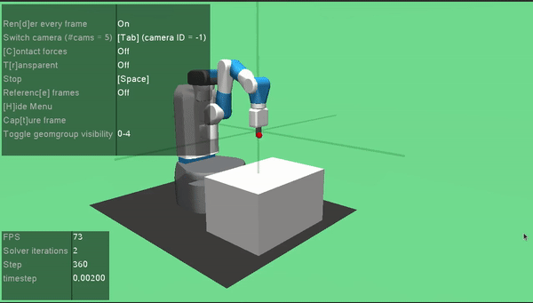

# gym_fetch_tutorial
A tutorial to get a Fetch Mobile Manipulator in the Gymnasium-Robotics simulator for Reinforcement Learning. 

## References and Resources

## Workspace
Make sure that you have [Ubuntu 20.04](https://releases.ubuntu.com/20.04/) or above installed on your computer. The tutorial was created on a Jupyter Notebook; thus, you should install the web-based interactive development environment on your local machine. 

```bash
sudo apt-get update
pip install notebook
```
This will install Jupyter Notebook on your computer. Once your system is set up, clone the [gym_fetch_tutorial](https://github.com/alan-sanchez/gym_fetch_tutorial.git) to your desired workspace. 


## Getting Started
Run the below command in your terminal.

Then, to run the notebook, type the following command in your terminal:
```bash
jupyter notebook
```
Navigate to the `Fetch_tutorial.ipynb` file and in the directory, you saved this package and open the file.
From there, you can follow through the tutorial. Ideally, you should have the Fetch simulator behave the same as the gif below


